# CafeCrescendo ☕️

**CafeCrescendo** - это веб-приложение для уютной кофейни, демонстрирующее меню, специальные предложения и удобную корзину для заказов. Интерфейс выполнен в теплых тонах и создаёт атмосферу настоящего кофейного заведения.

***

## 🌐 Демо: https://kirillxxn.github.io/CafeCrescendo/

***

## 🚀 Возможности

- ☕️ Просмотр подробного меню с категориями напитков и десертов
- 🛒 Добавление товаров в корзину с возможностью изменения количества
- 💸 Удобное оформление заказа с подсчётом общей суммы
- 📱 Адаптивный интерфейс, который отлично выглядит на любом устройстве
- 🎨 Элегантный и современный дизайн с плавными анимациями
- 🤵‍♂️ Возможность регистрации личного профиля
  
***

## 🛠️ Технологии
<p align="left">
<a href="https://www.typescriptlang.org/" target="_blank" rel="noreferrer"></a>
<a href="https://zustand-demo.pmnd.rs/" target="_blank" rel="noreferrer"></a>
<a href="https://developer.mozilla.org/en-US/docs/Web/JavaScript" target="_blank" rel="noreferrer"></a>
<a href="https://developer.mozilla.org/en-US/docs/Glossary/HTML5" target="_blank" rel="noreferrer"></a>
<a href="https://reactjs.org/" target="_blank" rel="noreferrer"></a>
<a href="https://www.w3.org/TR/CSS/#css" target="_blank" rel="noreferrer"></a>
<a href="https://vitejs.dev/" target="_blank" rel="noreferrer"></a>
<a href="https://github.com/css-modules/css-modules" target="_blank" rel="noreferrer"></a>
</p>

***
## 📦 Установка и запуск

Следуйте этим шагам, чтобы запустить проект локально:

1. **Клонируйте репозиторий:**

   ```bash
   git clone https://github.com/kirillxxn/CafeCrescendo.git
   cd CafeCrescendo
   ```
2. **Установите зависимости:**

   ```bash
    npm i
   ```
3. **Запустите проект в режиме разработки:**

   ```bash
    npm run dev
   ```
4. **Откройте приложение в браузере:**

   ```Перейдите по адресу:
    http://localhost:5173
   ```
***

## 📸 Пример работы проекта
  <div align="center">
  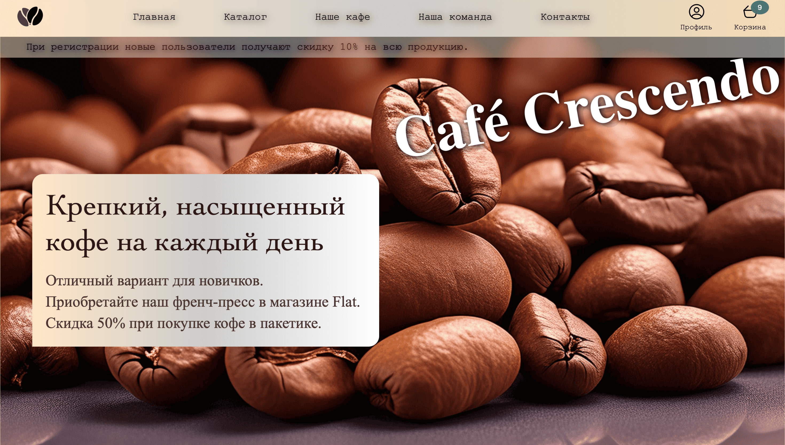
  
<hr> 

  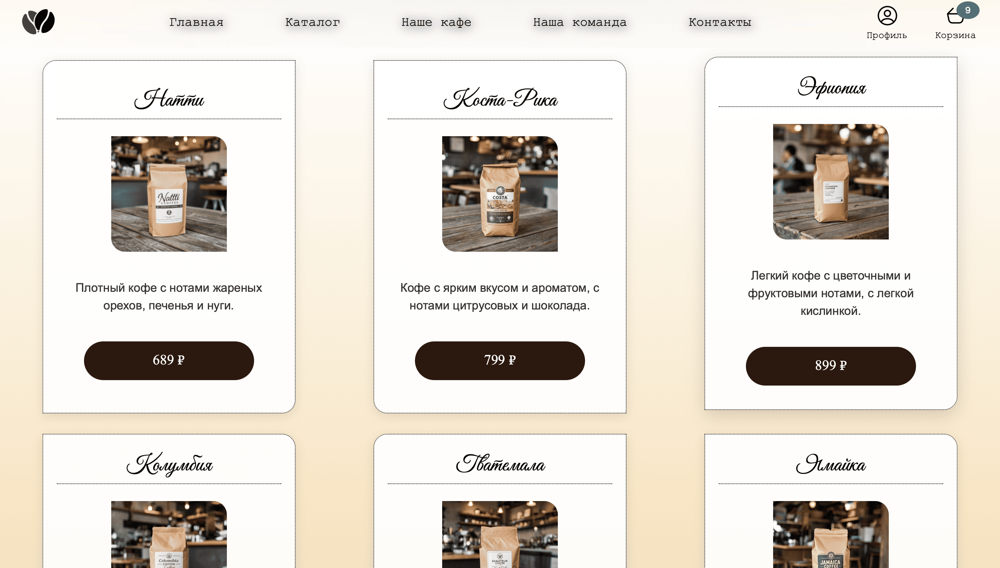

<hr>

  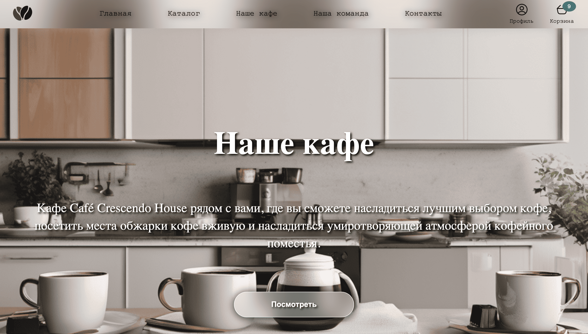
  
<hr> 

  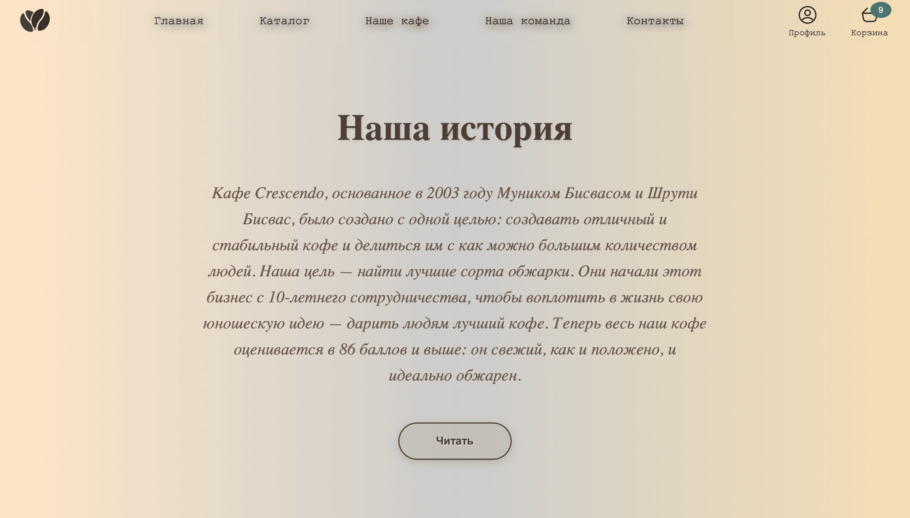

<hr>

  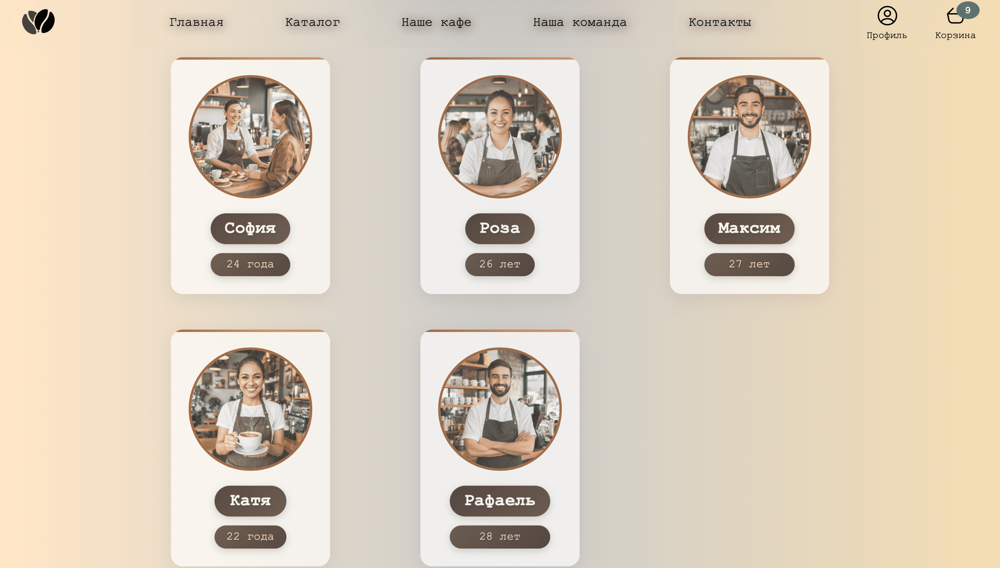
  
<hr> 

  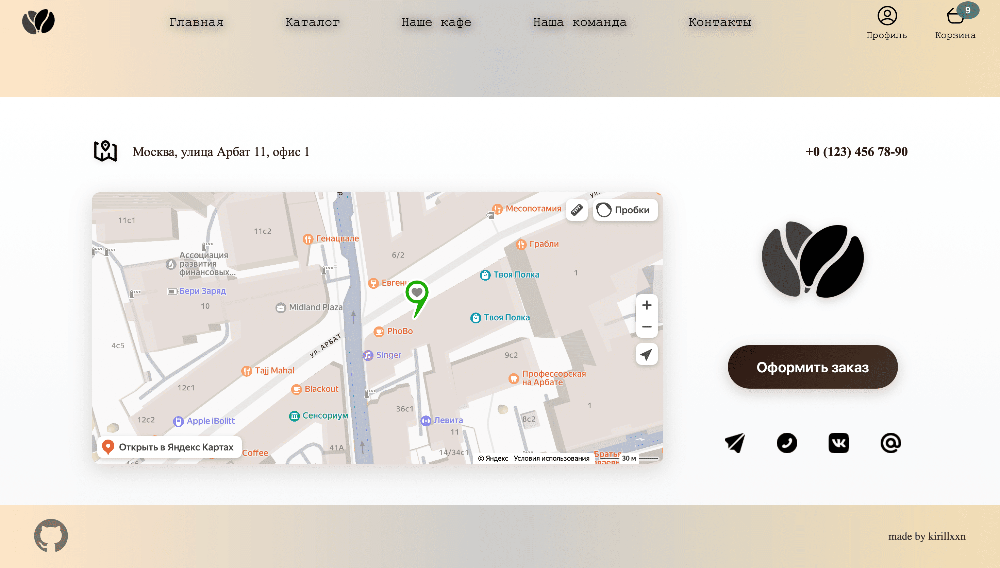

<hr>

  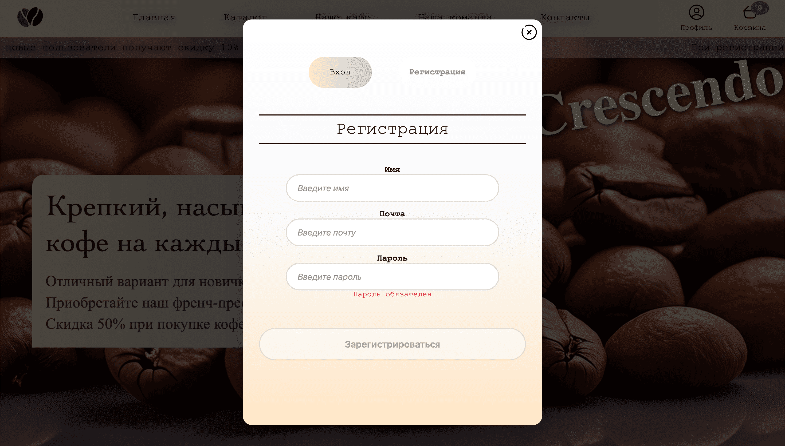
  
<hr> 

  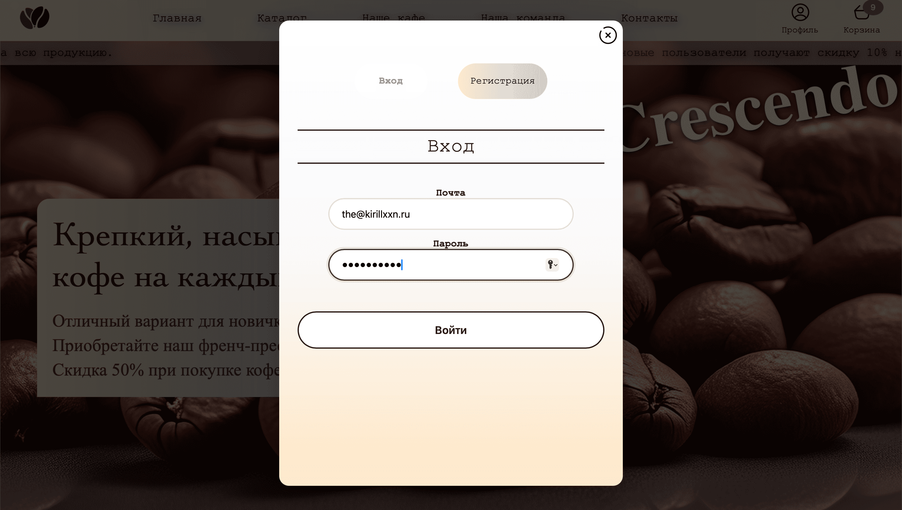

<hr>

  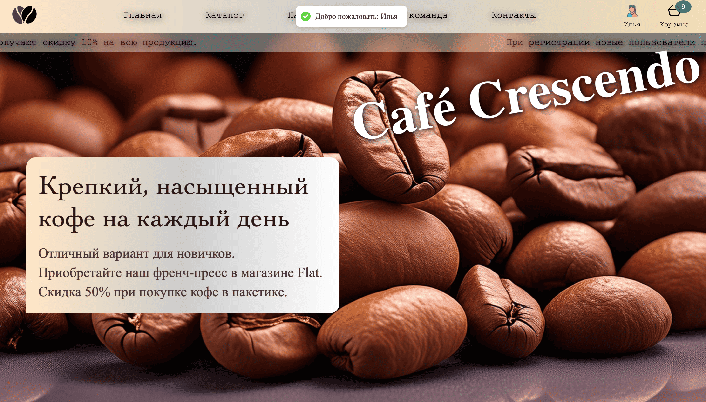
  
<hr> 

  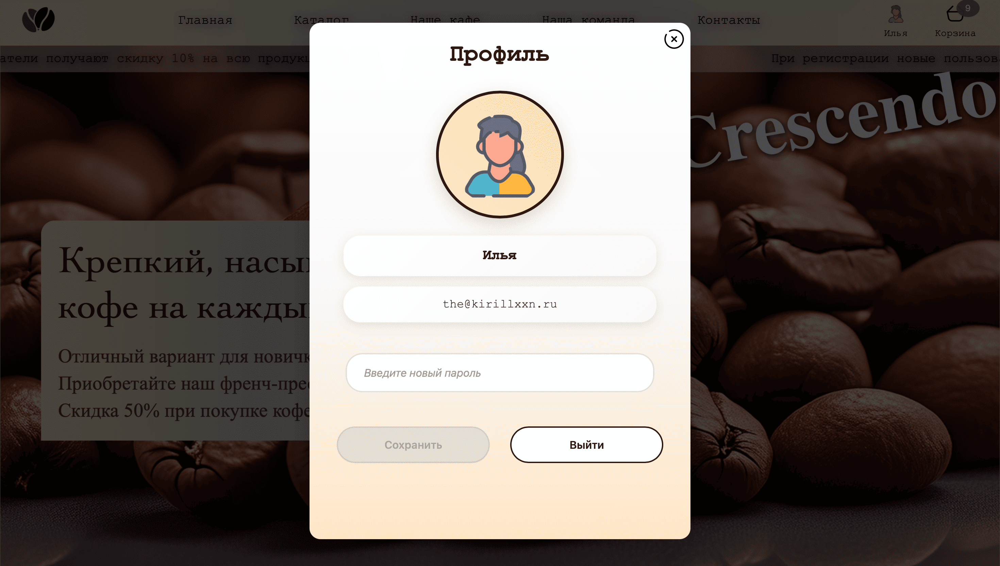

<hr>

  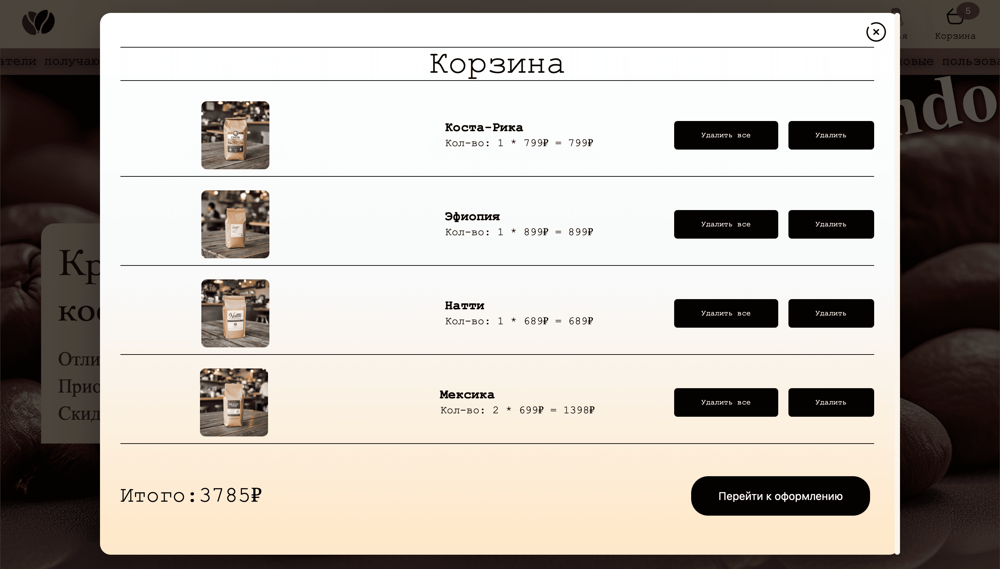

<hr> 

  

</div>

***

### 👨‍💻 Разработчик

Илья - kirillxxn

***

### 📄 Лицензия

Этот проект является открытым и распространяется под лицензией MIT.

***


### ⭐ Не забудьте поставить звезду репозиторию, если вам понравился проект!
